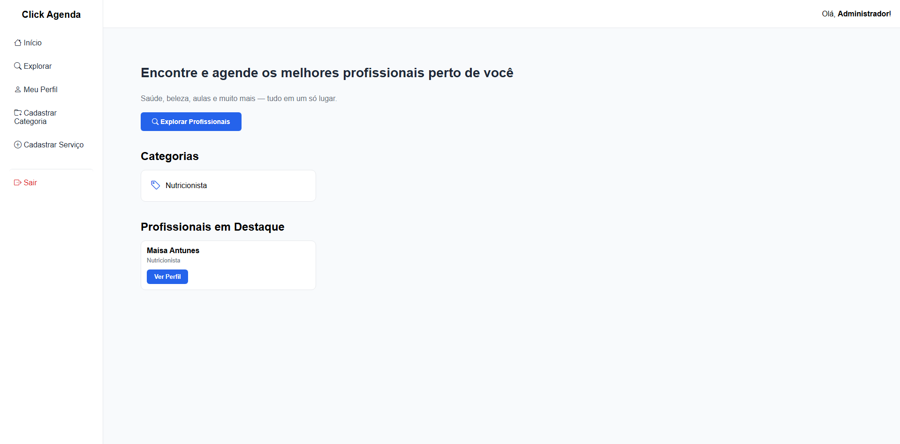
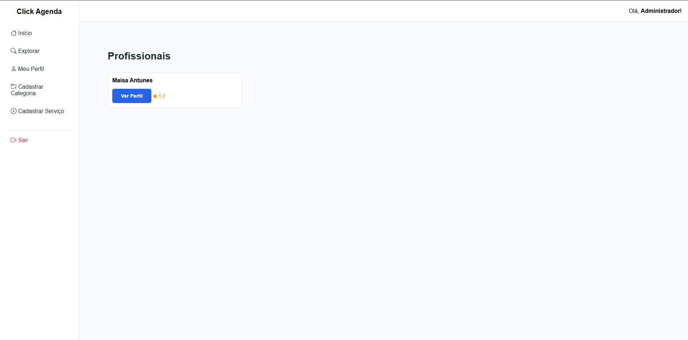
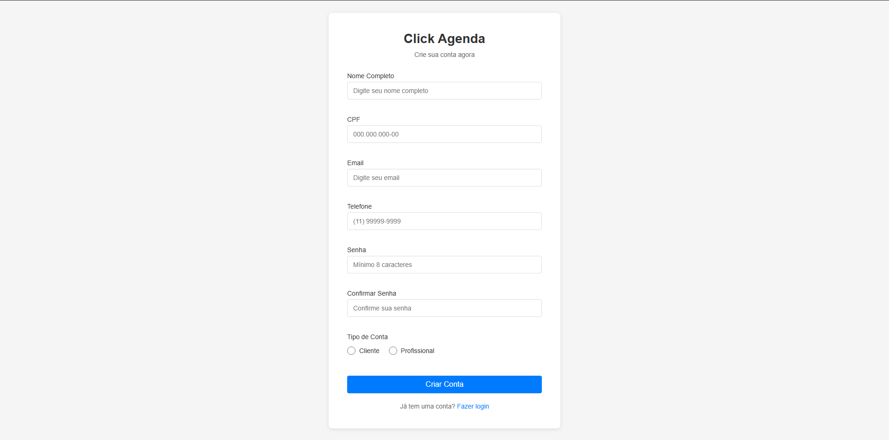
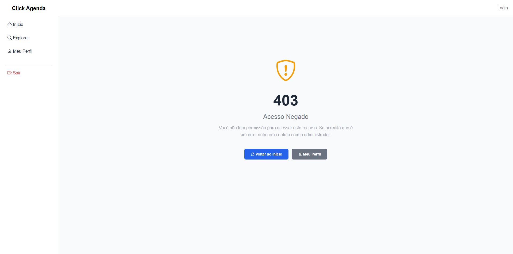

# Plataforma de Agendamento Multi-Profissional

> Um projeto por Marcos e Jorge

Um sistema web para facilitar o gerenciamento de agendamentos para múltiplos profissionais. O projeto é um portal onde profissionais (médicos, cabeleireiros, instrutores) podem cadastrar seus serviços e horários disponíveis, e clientes podem buscar e marcar horários.

Voltado para profissionais autônomos e pequenos negócios, o sistema oferece um ambiente seguro, simples e acessível para organização de consultas e serviços.

## 👤 Perfis de Usuário

O sistema é desenhado com três níveis de acesso principais:

- **Cliente:** Realiza buscas, visualiza perfis profissionais e gerencia seus próprios agendamentos (marcar, editar e cancelar).
- **Profissional (Prestador de Serviço):** Cadastra seus serviços, define sua grade de horários disponíveis, bloqueia datas e gerencia os agendamentos recebidos.
- **Administrador:** Gerencia o cadastro de novos profissionais, clientes e as categorias de serviços disponíveis na plataforma.

## ✨ Funcionalidades Principais

- **📅 Agendamento de Serviços:** Clientes podem criar, editar e cancelar agendamentos com base na disponibilidade do profissional.
- **👤 Cadastro de Perfis:** Múltiplos perfis (Cliente, Profissional) com diferentes permissões.
- **🔍 Busca de Profissionais:** Filtros por especialidade, localização e horários disponíveis.
- **🗓️ Agenda Pessoal:** Cada profissional gerencia sua própria agenda, definindo horários de trabalho, pausas e bloqueios.
- **🔐 Login com Controle de Acesso:** Separação clara do que cada perfil de usuário pode acessar e fazer.

## 🛠️ Tecnologias Utilizadas

- **Java 17+:** Linguagem principal da aplicação.
- **Spring Boot 4.x:** Framework para aplicações web.
- **Spring MVC:** Para construção dos controllers e rotas.
- **Spring Data JPA:** Para persistência de dados e ORM.
- **Thymeleaf:** Motor de templates para renderizar o HTML dinamicamente no servidor.
- **HTML / CSS:** Estrutura e estilo das páginas.
- **H2 Database:** Banco de dados em memória para desenvolvimento e testes.
- **Jakarta Validation:** Para validação dos dados de entrada.
- **Git:** Para versionamento de código.

## 🚀 Como Executar o Projeto

Siga os passos em [Setup](/docs/SETUP.md)

### 1. Pré-requisitos

Antes de começar, você vai precisar ter as seguintes ferramentas instaladas:

- **Java 17 JDK** (Verifique com `java -version`).
- **Git** (Verifique com `git --version`).
- **VS Code** com o "Extension Pack for Java" (ou sua IDE Java preferida, como IntelliJ/Eclipse).

### 2. Clonar o Repositório

```bash
# Clone o projeto usando HTTPS
git clone [https://github.com/](https://github.com/)[usuario]/[repositorio].git
# Entre na pasta
cd [repositorio]
```

### 3. Abrir no VS Code (ou IDE)

- No VS Code, use "File > Open Folder" e selecione a pasta do projeto.
- Aguarde a IDE indexar os arquivos e baixar as dependências do Java (Maven/Gradle).

### 4. Executar a Aplicação

A forma mais simples de rodar um projeto Spring Boot é pela sua classe principal:

1.  No explorador de arquivos, encontre a classe principal (que contém a anotação `@SpringBootApplication`, ex: `AgendamentoApplication.java`)[cite: 68].
2.  Clique no botão "Run" que aparece acima do método `main`.
3.  O servidor será iniciado.

Quando a inicialização for concluída, você verá no terminal algo como:
`Tomcat started on port(s): 8080 (http)`

**Acesse em:** [http://localhost:8080](http://localhost:8080)

### 5. Problemas Comuns

- **Erro de versão do Java:** Garanta que sua IDE está configurada para usar o JDK 17.
- **Porta 8080 em uso:** Se outra aplicação já estiver usando a porta, mude-a no arquivo `application.properties` (ex: `server.port=8081`).

### 🎯 Lógica de Categorias (Otimizada)

A relação entre Profissional e Categoria foi desenhada para evitar redundância:

1. **Profissional declara suas competências**: Usa `POST /api/profissional/{id}/categorias` para adicionar categorias que atende
2. **Serviços herdam a validação**: Ao criar um Serviço, a categoria escolhida **deve estar na lista de categorias do profissional** (validação automática)
3. **Sem duplicação**: Não há dados redundantes - a informação de qual categoria o profissional atende está apenas uma vez

**Fluxo correto:**

```
1. Criar Profissional
   ↓
2. Adicionar Categorias ao Profissional (POST /profissional/{id}/categorias)
   ↓
3. Criar Serviços (apenas nas categorias habilitadas) ✅
```

**Tentativa inválida:**

```
Tentar criar Serviço em categoria NÃO habilitada
→ Erro 400: "Profissional não está habilitado para atender a categoria"
```

---

## 🔗 Exemplo de Requisição - Criar Agendamento (POST Principal)

### Request

```
POST /api/agendamento HTTP/1.1
Host: localhost:8080
Content-Type: application/json

{
  "profissionalId": 1,
  "clienteId": 2,
  "servicoId": 1,
  "dataHora": "2026-03-15T14:30:00",
  "obs": "Corte tradicional com barba",
  "valor": 85.50
}
```

### Response (201 Created)

```json
{
  "id": 1,
  "dataHora": "2026-03-15T14:30:00",
  "obs": "Corte tradicional com barba",
  "valor": 85.5,
  "status": "PENDENTE",
  "profissional": {
    "id": 1,
    "nome": "João Silva Barbeiro",
    "cpf": "11144477735",
    "email": "joao@barber.com",
    "telefone": "11999999999",
    "horariosTrabalho": [
      {
        "id": 1,
        "diaSemana": "SEGUNDA",
        "horarioInicio": "08:00:00",
        "horarioFim": "18:00:00",
        "diaFolga": false,
        "profissionalId": 1,
        "profissionalNome": "João Silva Barbeiro"
      }
    ]
  },
  "cliente": {
    "id": 2,
    "nome": "Carlos Santos",
    "cpf": "987.654.321-11",
    "email": "carlos@email.com",
    "telefone": "11988888888"
  },
  "servico": {
    "id": 1,
    "nome": "Corte + Barba",
    "valor": 85.5,
    "duracaoMinutos": 60
  }
}
```

---

## 📋 Testes de Endpoints (Postman/Insomnia)

Uma coleção completa de requisições para testar todos os endpoints está disponível em:

📄 **Arquivo:** [`docs/postman-collection.json`](docs/postman-collection.json)

**Como importar no Postman:**

1. Abra o Postman
2. Clique em "Import" → "Upload Files"
3. Selecione o arquivo `docs/postman-collection.json`
4. Clique em "Import"

**Como importar no Insomnia:**

1. Abra o Insomnia
2. Clique em "Import/Export" → "Import Data"
3. Selecione o arquivo `docs/postman-collection.json`
4. Clique em "Scan"

Ou use este comando curl para testar:

```bash
curl -X POST http://localhost:8080/api/agendamento \
  -H "Content-Type: application/json" \
  -d '{"profissionalId":1,"clienteId":2,"servicoId":1,"dataHora":"2026-03-15T14:30:00","obs":"Corte","valor":85.50}'
```

---

## 📁 Estrutura de Pastas (Projeto Atual)

```
MultiAgenda/
├── src/
│   ├── main/
│   │   ├── java/br/iff/edu/ccc/clickagenda/
│   │   │   ├── controller/
│   │   │   │   └── restapi/
│   │   │   │       ├── AgendamentoRestController.java
│   │   │   │       ├── ClienteRestController.java
│   │   │   │       ├── ProfissionalRestController.java
│   │   │   │       ├── ServicoRestController.java
│   │   │   │       ├── CategoriaRestController.java
│   │   │   │       ├── HorarioTrabalhoRestController.java
│   │   │   │       ├── AuthRestController.java
│   │   │   │       └── RestMainApiController.java
│   │   │   │
│   │   │   ├── service/
│   │   │   │   ├── AgendamentoService.java
│   │   │   │   ├── ClienteService.java
│   │   │   │   ├── ProfissionalService.java
│   │   │   │   ├── ServicoService.java
│   │   │   │   ├── CategoriaService.java
│   │   │   │   └── HorarioTrabalhoService.java
│   │   │   │
│   │   │   ├── model/
│   │   │   │   ├── Usuario.java (classe abstrata)
│   │   │   │   ├── Profissional.java
│   │   │   │   ├── Cliente.java
│   │   │   │   ├── Agendamento.java
│   │   │   │   ├── Servico.java
│   │   │   │   ├── Categoria.java
│   │   │   │   ├── HorarioTrabalho.java
│   │   │   │   └── Admin.java
│   │   │   │
│   │   │   ├── repository/
│   │   │   │   ├── UsuarioRepository.java
│   │   │   │   ├── ProfissionalRepository.java
│   │   │   │   ├── ClienteRepository.java
│   │   │   │   ├── AgendamentoRepository.java
│   │   │   │   ├── ServicoRepository.java
│   │   │   │   ├── CategoriaRepository.java
│   │   │   │   └── HorarioTrabalhoRepository.java
│   │   │   │
│   │   │   ├── dto/
│   │   │   │   ├── request/
│   │   │   │   │   ├── ProfissionalRequestDTO.java
│   │   │   │   │   ├── ClienteRequestDTO.java
│   │   │   │   │   ├── AgendamentoRequestDTO.java
│   │   │   │   │   ├── ServicoRequestDTO.java
│   │   │   │   │   ├── CategoriaRequestDTO.java
│   │   │   │   │   └── HorarioTrabalhoRequestDTO.java
│   │   │   │   │
│   │   │   │   └── response/
│   │   │   │       ├── ProfissionalResponseDTO.java
│   │   │   │       ├── ClienteResponseDTO.java
│   │   │   │       ├── AgendamentoResponseDTO.java
│   │   │   │       ├── ServicoResponseDTO.java
│   │   │   │       ├── CategoriaResponseDTO.java
│   │   │   │       └── HorarioTrabalhoResponseDTO.java
│   │   │   │
│   │   │   ├── exception/
│   │   │   │   ├── GlobalExceptionHandler.java
│   │   │   │   ├── BadRequestException.java
│   │   │   │   ├── ForbiddenException.java
│   │   │   │   └── NotFoundException.java
│   │   │   │
│   │   │   ├── enums/
│   │   │   │   ├── Status.java
│   │   │   │   ├── Perfil.java
│   │   │   │   └── DiaSemana.java
│   │   │   │
│   │   │   └── MultiAgendaApplication.java
│   │   │
│   │   └── resources/
│   │       ├── application.properties
│   │       ├── static/css/style.css
│   │       └── templates/home.html
│   │
│   └── test/
│       └── java/.../ClickAgendaApplicationTests.java
│
├── docs/
│   └── postman-collection.json
│
├── pom.xml
├── mvnw
├── mvnw.cmd
└── README.md
```

---

## 🧪 API Endpoints - Resumo Rápido

### Profissional

| Método | Endpoint                            | Descrição                           |
| :----- | :---------------------------------- | :---------------------------------- |
| POST   | `/api/profissional`                 | Criar profissional                  |
| GET    | `/api/profissional`                 | Listar todos                        |
| GET    | `/api/profissional/{id}`            | Buscar por ID                       |
| PUT    | `/api/profissional/{id}`            | Atualizar                           |
| DELETE | `/api/profissional/{id}`            | Deletar                             |
| POST   | `/api/profissional/{id}/categorias` | Vincular categorias ao profissional |

### Cliente

| Método | Endpoint            | Descrição     |
| ------ | ------------------- | ------------- |
| POST   | `/api/cliente`      | Criar cliente |
| GET    | `/api/cliente`      | Listar todos  |
| GET    | `/api/cliente/{id}` | Buscar por ID |
| PUT    | `/api/cliente/{id}` | Atualizar     |
| DELETE | `/api/cliente/{id}` | Deletar       |

### Serviço

| Método | Endpoint            | Descrição     |
| ------ | ------------------- | ------------- |
| POST   | `/api/servico`      | Criar serviço |
| GET    | `/api/servico`      | Listar todos  |
| GET    | `/api/servico/{id}` | Buscar por ID |
| PUT    | `/api/servico/{id}` | Atualizar     |
| DELETE | `/api/servico/{id}` | Deletar       |

### Categoria

| Método | Endpoint              | Descrição       |
| ------ | --------------------- | --------------- |
| POST   | `/api/categoria`      | Criar categoria |
| GET    | `/api/categoria`      | Listar todos    |
| GET    | `/api/categoria/{id}` | Buscar por ID   |
| PUT    | `/api/categoria/{id}` | Atualizar       |
| DELETE | `/api/categoria/{id}` | Deletar         |

### Agendamento

| Método | Endpoint                                                             | Descrição         |
| ------ | -------------------------------------------------------------------- | ----------------- |
| POST   | `/api/agendamento`                                                   | Criar agendamento |
| GET    | `/api/agendamento`                                                   | Listar todos      |
| GET    | `/api/agendamento/{id}`                                              | Buscar por ID     |
| PUT    | `/api/agendamento/{id}`                                              | Atualizar         |
| PUT    | `/api/agendamento/{id}/confirmar?idProfissional={id}`                | Confirmar         |
| PUT    | `/api/agendamento/{id}/recusar?idProfissional={id}`                  | Recusar           |
| DELETE | `/api/agendamento/{id}?idUsuarioSolicitante={id}&tipoUsuario={tipo}` | Cancelar          |

### HorarioTrabalho

| Método | Endpoint                                              | Descrição              |
| ------ | ----------------------------------------------------- | ---------------------- |
| POST   | `/api/horario-trabalho`                               | Criar horário          |
| GET    | `/api/horario-trabalho`                               | Listar todos           |
| GET    | `/api/horario-trabalho/{id}`                          | Buscar por ID          |
| GET    | `/api/horario-trabalho/profissional/{profissionalId}` | Listar do profissional |
| PUT    | `/api/horario-trabalho/{id}`                          | Atualizar              |
| DELETE | `/api/horario-trabalho/{id}`                          | Deletar                |

---

## 📚 Manual de Execução Detalhado

### Requisitos do Sistema

- **Java 17+** (JDK): Certifique-se que está instalado com `java -version`
- **Git**: Para clonar o repositório
- **IDE com suporte a Java**: VS Code (com Extension Pack for Java), IntelliJ IDEA ou Eclipse
- **Navegador moderno**: Chrome, Firefox, Safari ou Edge
- **Porta 8080** disponível (ou configurável em `application.properties`)

### Passo 1: Clonar o Repositório

```bash
# Clone via HTTPS
git clone https://github.com/Prog-Web-2025-2-Marcos-e-Jorge/ClickAgenda.git

# Ou via SSH
git clone git@github.com:Prog-Web-2025-2-Marcos-e-Jorge/ClickAgenda.git

# Entre no diretório
cd ClickAgenda
```

### Passo 2: Abrir no VS Code

1. Abra o VS Code
2. **File → Open Folder** → Selecione a pasta `ClickAgenda`
3. Aguarde a IDE indexar os arquivos (pode levar alguns minutos)
4. Certifique-se que a extensão **Extension Pack for Java** está instalada

### Passo 3: Configurar Variáveis de Ambiente (Opcional)

Se desejar alterar a porta ou outras configurações:

1. Abra `src/main/resources/application.properties`
2. Modifique conforme necessário:
   ```properties
   server.port=8080                          # Porta do servidor
   spring.datasource.url=jdbc:h2:mem:testdb  # URL do banco H2
   spring.h2.console.enabled=true            # Console H2 habilitado
   ```

### Passo 4: Executar a Aplicação

**Opção A: Pelo VS Code (Recomendado)**

1. Localize o arquivo `src/main/java/br/iff/edu/ccc/clickagenda/ClickAgendaApplication.java`
2. Você verá um botão **"Run"** acima do método `public static void main(String[] args)`
3. Clique em **Run** (ou pressione `F5`)
4. Aguarde a mensagem: `Tomcat started on port(s): 8080`

**Opção B: Pelo Terminal**

```bash
# No Windows
mvnw.cmd spring-boot:run

# No Linux/Mac
./mvnw spring-boot:run
```

**Opção C: Build e Execução Manual**

```bash
# Compilar o projeto
mvnw clean compile

# Empacotar em JAR
mvnw package

# Executar o JAR
java -jar target/clickagenda-0.0.1-SNAPSHOT.jar
```

### Passo 5: Acessar a Aplicação

- **URL Principal**: [http://localhost:8080](http://localhost:8080)
- **Console H2 Database**: [http://localhost:8080/h2-console](http://localhost:8080/h2-console)
  - JDBC URL: `jdbc:h2:mem:testdb`
  - Username: `sa`
  - Password: (deixar em branco)

### Passo 6: Dados de Teste

No primeiro acesso, o banco de dados H2 estará vazio. Para popular com dados iniciais:

1. Acesse `/categoria/novo` (login como admin) para criar categorias
2. Depois crie profissionais e serviços

### Troubleshooting Comum

| Problema                         | Solução                                                                        |
| -------------------------------- | ------------------------------------------------------------------------------ |
| `Porta 8080 em uso`              | Mude em `application.properties`: `server.port=8081`                           |
| `Erro "Cannot find module java"` | Instale o Extension Pack for Java no VS Code                                   |
| `Erro de compilação Maven`       | Execute `mvnw clean install` para baixar dependências                          |
| `H2 Console não abre`            | Verifique se `spring.h2.console.enabled=true` está em `application.properties` |

---

## 🖼️ Guia de Telas Principais

Este guia apresenta as principais interfaces do sistema.

---

### 1️⃣ Tela Inicial (Home)

**Descrição**: Página de boas-vindas com busca rápida de profissionais e categorias  
**URL**: [http://localhost:8080](http://localhost:8080) (após login)

**Funcionalidades Principais**:

- Barra de navegação com opções de login/logout
- Seção de categorias de serviços disponíveis
- Lista de profissionais em destaque
- Call-to-action para explorar profissionais
- Hero section com busca rápida

**📸 IMAGEM DA TELA INICIAL**



**Caminho do arquivo no projeto**: `src/main/resources/templates/index.html`

---

### 2️⃣ Listagem de Profissionais

**Descrição**: Grid com todos os profissionais cadastrados  
**URL**: [http://localhost:8080/profissionais](http://localhost:8080/profissionais)

**Funcionalidades Principais**:

- Nome do profissional
- Avaliação (rating) em estrelas
- Botão "Ver Perfil" para acessar detalhes
- Grid responsivo com layout adaptável
- Sem resultados quando lista vazia

**📸 IMAGEM DA LISTAGEM DE PROFISSIONAIS**



**Caminho do arquivo no projeto**: `src/main/resources/templates/profissional/profissionais.html`

### 3️⃣ Formulário de Cadastro (Categoria)

**Descrição**: Formulário para criar nova categoria de serviços  
**URL**: [http://localhost:8080/categoria/novo](http://localhost:8080/categoria/novo)  
**Requer**: Login com perfil ADMIN

**Funcionalidades Principais**:

- Campo de entrada para nome da categoria
- Validação em tempo real com mensagens de erro
- Mensagens em português customizadas
- Botões: "Salvar Categoria" e "Cancelar"
- Feedback visual de sucesso/erro

**📸PRINT DO FORMULÁRIO DE CADASTRO**



**Caminho do arquivo no projeto**: `src/main/resources/templates/categoria/categoria-formulario.html`

### 4️⃣ Página de Erro Customizada (404)

**Descrição**: Tela customizada para erros HTTP (4xx/5xx)  
**URLs Exemplos**:

- `http://localhost:8080/pagina-inexistente` (404)
- `http://localhost:8080/acesso-negado` (403)

**Funcionalidades Principais**:

- Ícone decorativo e significativo para cada tipo de erro
- Número do erro em destaque
- Mensagem clara e amigável em português
- Botões para navegação: "Voltar ao Início" ou "Voltar Atrás"
- Design elegante e responsivo

**📸 ADICIONAR AQUI O PRINT DA PÁGINA DE ERRO**



**Caminho dos arquivos no projeto**:

- `src/main/resources/templates/error/404.html`
- `src/main/resources/templates/error/403.html`
- `src/main/resources/templates/error/400.html`
- `src/main/resources/templates/error/500.html`

**Tipos de Erros Customizados**:
| Código | Mensagem | Ícone |
|--------|----------|-------|
| **404** | "Página não encontrada" | ❓ |
| **403** | "Acesso Proibido" | 🔒 |
| **400** | "Requisição Inválida" | ⚠️ |
| **500** | "Erro Interno do Servidor" | 💥 |

### Versão Atual: v2.0.0

#### Principais Melhorias na v2.0:

- ✅ Reorganização completa de estrutura de templates em pastas
- ✅ Controllers de View separados de Controllers REST API
- ✅ Telas com layout responsivo e design melhorado
- ✅ Sistema de erros customizado (404, 403, 400, 500)
- ✅ Suporte a múltiplos perfis de usuário (Cliente, Profissional, Admin)
- ✅ Cadastro de horários de trabalho com validação completa
- ✅ Agendamentos com confirmação e recusa
